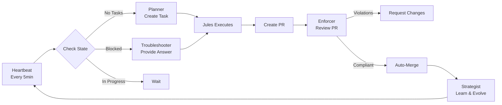

# Autonomous Development Lifecycle (ADL)

An autonomous development system powered by GitHub Actions, Jules AI, and Gemini CLI that continuously plans, executes, and evolves your codebase based on the **Ralph methodology**.

## Overview

This system implements a fully autonomous development loop where:
- 🤖 **AI agents plan** tasks based on your goals
- 🔨 **Jules executes** the implementation
- 🛡️ **Automated reviews** enforce code quality
- 📚 **System learns** from every merge

## Quick Start

### Prerequisites

- GitHub repository with Actions enabled
- [Jules AI](https://jules.ai) account and API access
- [Google Gemini API](https://ai.google.dev/) key
- [Gemini CLI](https://github.com/google-github-actions/run-gemini-cli) installed locally

### 1. Automated Setup (Recommended)

The easiest way to set up ADL is using the built-in Gemini extension. In your terminal, run:

```bash
/setup-adl
```

This command will:
- **Initialize Files**: Create `GOALS.md`, `TASKS.md`, `CONSTITUTION.md`, `.ralph-state.json`, etc., with default templates.
- **Configure Secrets**: Guide you through uploading `GEMINI_API_KEY` and `JULES_API_KEY` to GitHub Actions using the GitHub CLI (`gh`).

### 2. Manual Setup

If you prefer to set up manually, follow these steps:

#### A. Configure GitHub Secrets
Add these to `Settings` → `Secrets and variables` → `Actions`:

| Secret Name | Description | How to Get It |
|-------------|-------------|---------------|
| `GEMINI_API_KEY` | Gemini API key for AI planning and review | [Get API Key](https://ai.google.dev/) |
| `JULES_API_KEY` | Jules AI authentication key | [Get from jules.google.com](https://jules.google.com) |

#### B. Create Required Files
Create these files in your repository root:

#### `GOALS.md` - Your Long-Term Vision
```markdown
# Project Goals

- Build a scalable web application
- Maintain 80%+ test coverage
- Ship features weekly
```

#### `TASKS.md` - Your Backlog
```markdown
# Task Backlog

- [ ] Implement user authentication
- [ ] Add payment processing
- [ ] Create admin dashboard
```

#### `CONSTITUTION.md` - Code Quality Rules
```markdown
# Repository Constitution

## Language & Frameworks
- Always use TypeScript 5.4+
- Prefer functional components in React

## Testing
- Minimum 80% line coverage for new features
- Use Vitest for testing

## Architecture
- All API calls must reside in `/src/services`
- No inline fetch calls

## Naming
- Use `camelCase` for variables
- Use `PascalCase` for components

## Forbidden
- Do not use `any` type
- Do not add dependencies without justification

## Interaction
- Jules must never force-push to main
- Stop after 3 consecutive failures
```

#### `AGENTS.md` - Learning Log
```markdown
# Agent Memory & Performance

## Lessons Learned

- **[2026-01-14]**: Initial setup completed
```

#### `CONTEXT_MAP.md` - Architecture Guide
```markdown
# Context Map

- `/src/components`: UI Layer
- `/src/hooks`: Reusable logic
- `/src/services`: External API interfaces
- `/src/utils`: Helper functions
```

#### `TECH_DEBT.md` - Known Issues
```markdown
# Technical Debt

- [ ] Refactor authentication module
- [ ] Optimize database queries
```

### 3. Initialize the System

The `.ralph-state.json` file has already been created with the initial state. You can modify it if needed:

```json
{
  "status": "started",
  "current_task_id": null,
  "last_updated": "2026-01-14T09:55:00Z",
  "iteration_count": 0,
  "max_iterations": 10
}
```

### 4. Enable Workflows

The workflows are already in place in `.github/workflows/`. They will automatically start running based on their triggers:

- **Heartbeat**: Runs every 5 minutes (cron)
- **Planner**: Triggered by Heartbeat when needed
- **Troubleshooter**: Triggered by Heartbeat when blocked
- **Enforcer**: Runs on every pull request
- **Strategist**: Runs on merge to main

### 5. Monitor the System

Watch your autonomous development loop in action:

1. **Actions Tab**: Monitor workflow runs
2. **Pull Requests**: See automated reviews and merges
3. **Issues**: Check for blocked state notifications
4. **Files**: Watch `AGENTS.md` and `TASKS.md` evolve

## Scripts

The workflows use reusable bash scripts located in `.github/scripts/`:

- **State Management**: `read-state.sh`, `update-state.sh`, `restart-loop.sh`
- **Context Preparation**: `prepare-context.sh`, `prepare-pr-context.sh`, `prepare-merge-context.sh`, `prepare-tasks-context.sh`
- **Workflow Logic**: `check-trigger.sh`, `parse-audit-result.sh`, `commit-changes.sh`

See [.github/scripts/README.md](./.github/scripts/README.md) for details.

## How It Works

### The Autonomous Loop



### The Five Workflows

#### 1. **Heartbeat** (Orchestrator)
- Runs every 5 minutes
- Checks system status in `.ralph-state.json`
- Triggers Planner workflow when needed (based on time since last activity)
- Simple and lightweight - Jules action handles task management

#### 2. **Planner** (Task Creator)
- Analyzes `GOALS.md`, `TASKS.md`, `CONTEXT_MAP.md`, `AGENTS.md` using Gemini
- Generates detailed technical plans
- Uses `google-labs-code/jules-invoke@v1` to create and execute tasks
- Jules automatically creates PRs when work is complete

#### 3. **Troubleshooter** (Problem Solver)
- *Note: This workflow is optional and can be removed if not needed*
- Provides additional context to Jules when needed
- Uses Gemini to analyze codebase and answer questions

#### 4. **Enforcer** (Quality Guardian)
- Reviews PR diffs against `CONSTITUTION.md` using Gemini
- Posts violation comments or approves
- Auto-merges compliant PRs

#### 5. **Strategist** (Learning System)
- Extracts lessons from merged changes using Gemini
- Updates `AGENTS.md` with insights
- Removes completed tasks from `TASKS.md`
- Restarts the loop

## Configuration

### Adjust Heartbeat Frequency

Edit `.github/workflows/heartbeat.yml`:

```yaml
on:
  schedule:
    - cron: '*/5 * * * *'  # Change to '*/15 * * * *' for every 15 minutes
```

### Customize Gemini Model

Add to any workflow using Gemini CLI:

```yaml
- uses: google-github-actions/run-gemini-cli@v1
  with:
    gemini_api_key: ${{ secrets.GEMINI_API_KEY }}
    gemini_model: 'gemini-2.0-flash-exp'  # Specify model
    prompt: |
      Your prompt here
```

### Disable Auto-Merge

In `.github/workflows/enforcer.yml`, comment out the "Approve and merge" step to require manual merging.

## Stopping the System

To pause the autonomous loop:

1. Edit `.ralph-state.json`:
   ```json
   {
     "status": "stopped",
     ...
   }
   ```

2. Commit and push the change

The Heartbeat will detect the stopped status and terminate.

## Troubleshooting

### Workflows Not Running

- Check that GitHub Actions are enabled in repository settings
- Verify all required secrets are configured
- Check Actions tab for error messages

### Jules API Errors

- Verify `JULES_API_TOKEN` is valid
- Check Jules API endpoint URLs in workflows
- Review Jules API documentation for changes

### Gemini API Errors

- Ensure `GEMINI_API_KEY` is valid and has quota
- Check [Gemini API status](https://status.cloud.google.com/)
- Review rate limits in your Google Cloud project

### System Stuck in Blocked State

- Check Issues tab for blocked state notification
- Review the blocker question in Jules
- Manually update `.ralph-state.json` to restart if needed

## Best Practices

1. **Start Small**: Begin with simple tasks in `TASKS.md`
2. **Monitor Closely**: Watch the first few iterations carefully
3. **Refine Constitution**: Update rules based on what you observe
4. **Review Lessons**: Check `AGENTS.md` regularly for insights
5. **Set Limits**: Use `max_iterations` to prevent runaway loops

## Architecture

See [ARCHITECTURE.md](./ARCHITECTURE.md) for the complete system specification.

## Contributing

This is an autonomous system, but you can:
- Update `GOALS.md` to set new directions
- Add tasks to `TASKS.md` manually
- Refine rules in `CONSTITUTION.md`
- Review and approve PRs manually when needed

## License

MIT

## Support

For issues with:
- **GitHub Actions**: Check [GitHub Actions documentation](https://docs.github.com/en/actions)
- **Jules AI**: Contact Jules AI support
- **Gemini CLI**: See [google-github-actions/run-gemini-cli](https://github.com/google-github-actions/run-gemini-cli)

---

**⚠️ Important**: This system will autonomously create and merge PRs. Ensure your `CONSTITUTION.md` rules are comprehensive before enabling auto-merge in production environments.
